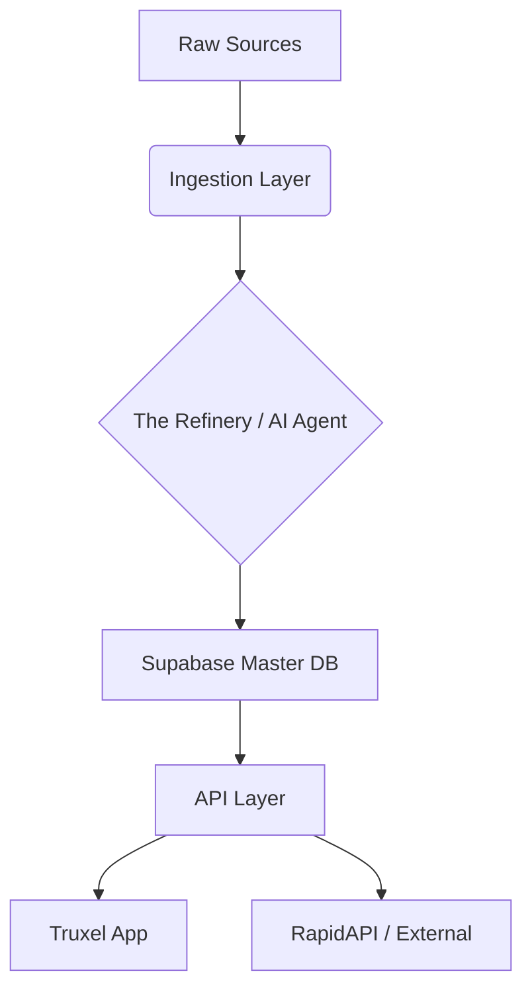

# Truxel Data Engine (TDE): Industrial Intelligence Masterplan

## 1. Executive Summary
**The Pivot:** We are moving from "Scraping Maps" to building an **Industrial Intelligence Refinery**. 

While Google Maps is a consumer directory (B2C), Truxel needs a B2B Logistics Database. This Masterplan outlines the creation of a standalone, modular application—**The Truxel Data Engine (TDE)**. 

**Core Value Proposition:**
1.  **For Truxel:** Provides an infinite stream of high-quality leads (manufacturers, shippers) to drivers, creating a "Loadboard 2.0" where drivers find work before it's even posted.
2.  **For External Sale:** A high-value API sold on RapidAPI/Apify that allows other businesses to find industrial leads by specific criteria (e.g., "Find all furniture manufacturers in Poland with >50 employees").

---

## 2. System Architecture

The system is designed as a **Pipeline** (ETL - Extract, Transform, Load) rather than a simple scraper.

### The "Refinery" Model



### 2.1. Input Sources (The "Crude Oil")
We use a **Waterfall Strategy** to minimize cost and maximize legality.

1.  **Tier 1: OpenStreetMap (OSM) - FREE**
    *   *Why:* Best source for "Industrial Zones". We query for `landuse=industrial`, `building=warehouse`, `man_made=works`.
    *   *Cost:* $0.
    *   *Volume:* Unlimited.
2.  **Tier 2: Official Registries - LOW COST**
    *   *Sources:* EU VAT VIES database, UK Companies House, US SEC EDGAR.
    *   *Why:* Verifies the company exists and is active.
3.  **Tier 3: Targeted Scraping (Outscraper/Apify) - MEDIUM COST**
    *   *Why:* Only used to "fill in the blanks" (phone numbers, reviews) for companies identified in Tier 1 & 2.
    *   *Strategy:* Don't scan the world. Scan the specific lat/long coordinates found in Tier 1.

---

## 3. Technical Stack & Implementation

### 3.1. Core Infrastructure
*   **Language:** Python (for data processing/pandas) + TypeScript (for API/Edge Functions).
*   **Database:** **Supabase** (PostgreSQL + PostGIS).
    *   *Critical:* We must use **PostGIS** extensions to handle "Search within 50km radius" efficiently.
*   **Orchestration:** **N8N** (Workflow management) or Temporal.io (for code-based workflows).
*   **Hosting:** Railway or Hetzner (cheaper for heavy data processing than Vercel).

### 3.2. The "Refinery" (AI Enrichment Agent)
This is the secret sauce that makes the data valuable.
Instead of just saving a name, we run a lightweight AI Agent (Gemini Flash/GPT-4o-mini) on each record:

*   **Input:** Company Name + Website.
*   **Agent Task:** "Analyze this company. Do they manufacture goods? Do they ship freight? What is their primary NAICS code?"
*   **Output:** `is_logistics_relevant: true/false`, `industry_tags: ["furniture", "export"]`.

### 3.3. Modular Configuration (The "Industry Profile")
To monetize this on RapidAPI, the system accepts a JSON configuration:

```json
{
  "target_industry": "textile_manufacturing",
  "keywords": ["fabric", "weaving", "textile mill"],
  "exclude_keywords": ["retail", "boutique", "shop"],
  "required_infrastructure": ["loading_dock", "industrial_zone"],
  "min_employee_count": 10
}
```
This allows you to spin up a new "Product" on RapidAPI just by changing the config (e.g., "Real Estate Lead Finder", "Dental Clinic Finder").

---

## 4. Database Schema (Supabase)

We need a dedicated schema separate from the main Truxel app to allow for external access.

```sql
-- Enable PostGIS for geographic queries
create extension postgis;

create table industrial_facilities (
  id uuid primary key default gen_random_uuid(),
  name text not null,
  website text,
  phone text,
  
  -- Geospatial Data
  location geography(POINT), -- Lat/Long
  address jsonb,
  
  -- Classification
  naics_code text,
  industry_category text, -- 'manufacturer', 'warehouse', '3pl'
  is_verified_shipper boolean default false,
  
  -- Enrichment
  ai_summary text,
  estimated_freight_volume text, -- 'low', 'medium', 'high'
  
  -- Metadata
  source text, -- 'osm', 'google', 'manual'
  last_updated timestamptz default now()
);

-- Index for fast radius search
create index facilities_geo_idx on industrial_facilities using GIST (location);
```

---

## 5. Monetization Strategy

### 5.1. Internal (Truxel App)
*   **Feature:** "Load Radar".
*   **Usage:** Driver is in Berlin. Opens Truxel. Sees map of 500 factories around him.
*   **Monetization:** Included in Truxel Premium Subscription.

### 5.2. External (RapidAPI / Apify)
*   **Product:** "Global Industrial B2B Leads API".
*   **Pricing:**
    *   **Free:** 50 requests/mo (Teaser).
    *   **Pro:** $49/mo for 5,000 requests.
    *   **Ultra:** $199/mo for 50,000 requests.
*   **Differentiation:** Unlike Google Places, our API allows filtering by "Has Loading Dock" or "Exports Goods".

### 5.3. Custom MCP Server
*   **Product:** "Truxel Intelligence MCP".
*   **Usage:** Sell access to AI Agents (using Cursor/Windsurf/Claude) to query your database directly.
*   **Example:** "Find me 20 potential clients for pallet sales in Romania."

---

## 6. Implementation Roadmap

### Phase 1: The OSM Harvester (Week 1-2)
*   **Goal:** Build the base map without spending money.
*   **Action:** Write a Python script using `osmnx` library to download all `landuse=industrial` polygons in target countries (RO, DE, PL).
*   **Output:** Database populated with ~50,000 raw industrial locations (no phone numbers yet).

### Phase 2: The Enrichment Layer (Week 3-4)
*   **Goal:** Add contact info.
*   **Action:** Connect Outscraper/Apify.
*   **Logic:** For each OSM point, search Google Maps *specifically* for that name + location to get the phone number/website.
*   **Cost Control:** Only enrich records that look promising (e.g., large area size).

### Phase 3: The API & Truxel Integration (Week 5)
*   **Goal:** Make data usable.
*   **Action:** Create Supabase Edge Functions (`get-nearby-facilities`).
*   **UI:** Add a "Map Layer" in the Truxel App (React Native Maps) showing these points as pins.

### Phase 4: Public Launch (Week 6+)
*   **Goal:** Monetize.
*   **Action:** Wrap the Edge Functions in a RapidAPI gateway. Publish the Apify Actor.

---

## 7. Legal & Compliance (The "Safe Harbor")

1.  **Attribution:** OpenStreetMap data requires ODbL attribution ("© OpenStreetMap contributors"). We must display this in the app.
2.  **GDPR:** We focus on **Business Data** (Company Name, General Phone), not Personal Data (John Doe's mobile).
3.  **Google ToS:** By using OSM as the *primary* source and only using Google for *verification/enrichment* of specific entities, we avoid "bulk scraping" of the map, staying in a safer grey area.

## 8. Next Steps for You

1.  **Initialize the Repo:** Create a new folder/repo `truxel-data-engine`.
2.  **Setup Supabase:** Create a new project or a new schema in the existing one.
3.  **Select Pilot Region:** Start with **Romania** (familiar territory) to validate the data quality.
