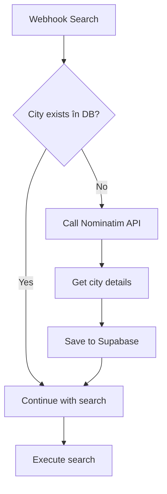

# n8n Workflow pentru Auto-Population Orașe

## Trigger: Webhook de la Search

Când primești un webhook pentru search, verifică și salvează orașul:

## Flow Propus:



## 1. Check City Exists (Supabase)

```sql
SELECT * FROM cities
WHERE country_code = $country_code
AND (
  LOWER(name) = LOWER($city_name)
  OR ST_DWithin(
    ST_MakePoint(lng, lat)::geography,
    ST_MakePoint($lng, $lat)::geography,
    10000 -- 10km radius
  )
)
LIMIT 1;
```

## 2. Nominatim API Call (dacă nu există)

```javascript
// OpenStreetMap Nominatim - GRATUIT!
const response = await fetch(
  `https://nominatim.openstreetmap.org/search?` +
  `city=${cityName}&` +
  `country=${countryCode}&` +
  `format=json&` +
  `limit=1&` +
  `extratags=1&` +
  `addressdetails=1`
);

const data = await response.json();

if (data.length > 0) {
  const cityData = data[0];

  // Extract population from extratags
  const population = cityData.extratags?.population ||
                    cityData.extratags?.['population:date'] ||
                    0;

  // Calculate importance (0-1)
  const importance = cityData.importance || 0.5;

  return {
    name: cityData.display_name.split(',')[0],
    lat: parseFloat(cityData.lat),
    lng: parseFloat(cityData.lon),
    population: parseInt(population) || 0,
    importance_score: importance,
    country_code: countryCode,
    country_name: cityData.address?.country || countryName,
    state_code: cityData.address?.state_code,
    osm_id: cityData.osm_id,
    osm_type: cityData.osm_type,
    bounding_box: cityData.boundingbox
  };
}
```

## 3. Save to Supabase

```sql
INSERT INTO cities (
  name,
  country_code,
  country_name,
  state_code,
  lat,
  lng,
  population,
  importance_score,
  is_user_generated,
  metadata
) VALUES (
  $name,
  $country_code,
  $country_name,
  $state_code,
  $lat,
  $lng,
  $population,
  $importance_score,
  true,
  $metadata -- JSON cu extra data
) ON CONFLICT (name, country_code) DO UPDATE
SET
  lat = EXCLUDED.lat,
  lng = EXCLUDED.lng,
  population = GREATEST(cities.population, EXCLUDED.population),
  usage_count = cities.usage_count + 1,
  updated_at = NOW();
```

## 4. Alternative API-uri (Backup)

### Opțiunea A: GeoNames (gratis până la 1000/oră)
```javascript
`http://api.geonames.org/searchJSON?` +
`q=${cityName}&` +
`country=${countryCode}&` +
`maxRows=1&` +
`username=YOUR_USERNAME`
```

### Opțiunea B: MapBox (mai scump dar mai bun)
```javascript
`https://api.mapbox.com/geocoding/v5/mapbox.places/` +
`${cityName}.json?` +
`country=${countryCode}&` +
`types=place&` +
`access_token=YOUR_TOKEN`
```

## 5. Rate Limiting & Caching

- Cache rezultatele pentru 24 ore
- Max 1 request/second către Nominatim
- Fallback pe GeoNames dacă Nominatim e down
- Queue cities pentru batch processing noaptea

## 6. Analytics Dashboard

Track în Supabase:
- Cities added per day
- Most requested missing cities
- Coverage by country
- User-generated vs pre-loaded ratio

## Benefits:

1. **Date Complete** - Population, boundaries, importance
2. **Validare** - Nu salvezi typos sau duplicate
3. **Cost Control** - Un singur loc pentru API calls
4. **Scalabil** - Poți procesa batch-uri noaptea
5. **Analytics** - Vezi ce zone sunt populare

## Schema Updată pentru Cities

```sql
ALTER TABLE cities
ADD COLUMN IF NOT EXISTS metadata JSONB,
ADD COLUMN IF NOT EXISTS osm_id BIGINT,
ADD COLUMN IF NOT EXISTS osm_type TEXT,
ADD COLUMN IF NOT EXISTS bounding_box TEXT[],
ADD COLUMN IF NOT EXISTS first_seen_at TIMESTAMPTZ DEFAULT NOW(),
ADD COLUMN IF NOT EXISTS last_used_at TIMESTAMPTZ DEFAULT NOW();

-- Index pentru metadata queries
CREATE INDEX IF NOT EXISTS idx_cities_metadata
ON cities USING gin(metadata);

-- Index pentru usage tracking
CREATE INDEX IF NOT EXISTS idx_cities_usage
ON cities(usage_count DESC, last_used_at DESC);
```