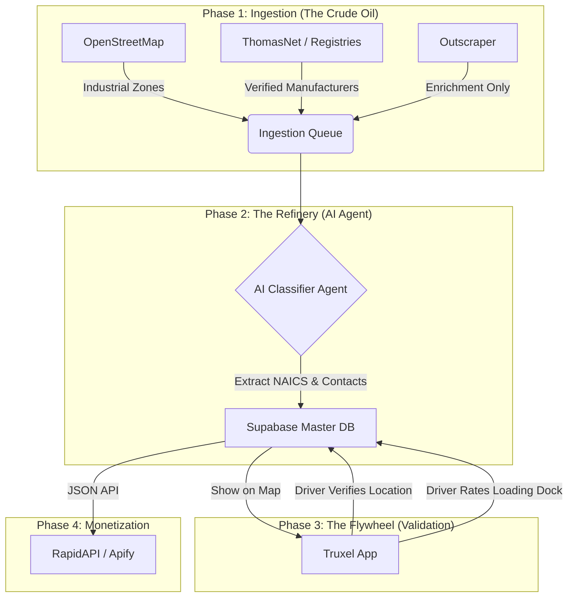

# Truxel Data Engine (TDE): The "Industrial Flywheel" Masterplan

## 1. Executive Summary & Vision
**The Goal:** Build the world's most accurate **B2B Logistics Database** by combining open data, AI enrichment, and a user-generated "Flywheel" effect from the Truxel app.

**The Problem:** Google Maps is for consumers (finding pizza), not logistics (finding loading docks). It is expensive ($32/1k req), restrictive (no caching), and lacks industrial context.
**The Solution:** A standalone "Refinery" engine that ingests raw data (OSM, Registries), refines it with AI, and verifies it via Truxel drivers.

**Monetization:**
1.  **Internal:** "Load Radar" for Truxel users (Premium feature).
2.  **External:** "B2B Industrial Leads API" on RapidAPI/Apify (SaaS).

---

## 2. The "Flywheel" Architecture

This is not just a scraper; it is a self-improving ecosystem.



---

## 3. Data Sourcing Strategy (The "Hybrid" Model)

We reject the "scrape everything" approach in favor of a precision "Sniper" approach.

### Tier 1: The Foundation (Free & Legal)
*   **OpenStreetMap (OSM):** The backbone. We query for:
    *   `landuse=industrial`
    *   `building=warehouse`
    *   `man_made=works`
    *   `industrial=*`
*   **ThomasNet / IndustryNet:** We scrape these *specifically* for US/North American manufacturing data as they are the "Gold Standard" mentioned in your draft.
*   **Official Registries:** EU VIES, UK Companies House (for existence verification).

### Tier 2: The Enrichment (Paid & Targeted)
*   **Outscraper / SerpApi:** Used **ONLY** to find missing phone numbers/websites for entities identified in Tier 1.
    *   *Cost:* ~$3/1,000 records (vs Google's $32).
    *   *Method:* Search "Company Name + City" -> Extract Phone/Email.

### Tier 3: The "Flywheel" (Proprietary & Defensible)
*   **Driver Validation:** When a Truxel driver is near a detected facility, we prompt: *"Is this a warehouse? [Yes/No]"*.
*   **Passive Collection:** Analyze GPS dwell times. If 50 trucks stop at coordinate X for >1 hour, it IS a logistics facility.

---

## 4. The "Refinery" (AI & Filtering)

Raw data is noisy. We use a Python-based AI pipeline to clean it.

### 4.1. NAICS & Keyword Filtering
We apply the filters identified in your draft:
*   **Keep:** NAICS 31-33 (Manufacturing), 48-49 (Transport/Warehousing), 42 (Wholesale).
*   **Keywords:** "distribution center", "3PL", "cold storage", "freight".
*   **Exclude:** "retail", "restaurant", "headquarters" (we want facilities, not offices).

### 4.2. The AI Agent (Gemini/GPT-4o-mini)
For every candidate, the agent executes:
```json
{
  "task": "Analyze this company website",
  "input": "www.example-factory.com",
  "questions": [
    "Do they manufacture physical goods?",
    "Do they have a shipping department?",
    "Extract the primary phone number for logistics."
  ]
}
```

---

## 5. Technical Implementation Steps

### Step 1: Database Setup (Supabase)
We need **PostGIS** for geospatial queries.

```sql
-- Enable PostGIS
create extension postgis;

-- The Master Table
create table industrial_facilities (
  id uuid primary key default gen_random_uuid(),
  name text not null,
  location geography(POINT) not null, -- Lat/Long
  
  -- Classification
  type text check (type in ('manufacturer', 'warehouse', 'logistics', 'port')),
  naics_code text,
  
  -- Contact
  phone text,
  email text,
  website text,
  
  -- Validation (The Flywheel)
  is_verified_by_driver boolean default false,
  driver_verification_count int default 0,
  
  -- Metadata
  source text, -- 'osm', 'thomasnet', 'manual'
  raw_data jsonb
);

-- Index for "Find near me"
create index facilities_geo_idx on industrial_facilities using GIST (location);
```

### Step 2: The Ingestion Engine (Python)
A modular Python script that can be configured for different industries.

```python
# config.json for RapidAPI monetization
{
  "industry_profile": "automotive_parts",
  "osm_tags": ["industrial", "factory"],
  "keywords": ["brakes", "engine", "tires"],
  "region": "RO"
}
```

### Step 3: The API Layer (Supabase Edge Functions)
We expose this data via a secure API.

*   `GET /facilities/nearby?lat=...&long=...&radius=50km&type=warehouse`
*   `POST /facilities/verify` (For drivers to confirm data)

---

## 6. Monetization & Modularization

### 6.1. RapidAPI / Apify Product
We package the Python Engine as an **Apify Actor**.
*   **User Input:** "Find me all Furniture Manufacturers in Italy."
*   **Process:** The Actor spins up -> Queries OSM -> Enriches via Outscraper -> Returns JSON.
*   **Price:** $0.05 per lead.

### 6.2. Truxel Premium Feature
*   **"Load Radar":** Drivers see a heatmap of potential shippers.
*   **"Backhaul Finder":** "You are unloading in Berlin? Here are 5 factories nearby that export to Romania."

---

## 7. Legal "Safe Harbor" Strategy

1.  **OSM Attribution:** We display "© OpenStreetMap contributors" on the map.
2.  **No Bulk Google Storage:** We do NOT store Google Maps Place IDs or cache their data indefinitely. We use Google/Outscraper only for *ephemeral* enrichment (getting the phone number) and store the *fact* (the phone number), not the Google proprietary metadata.
3.  **User Generated Content:** Data verified by Truxel drivers belongs to Truxel. This is our strongest legal defense (like Waze).

---

## 8. Execution Plan (10 Steps)

1.  **Repo Init:** Create `truxel-data-engine` (Python + Supabase).
2.  **DB Schema:** Run the SQL migration for `industrial_facilities` with PostGIS.
3.  **OSM Harvester:** Write script to pull `landuse=industrial` for Romania (Pilot).
4.  **Filter Logic:** Implement the NAICS/Keyword filter to remove "noise" (retail).
5.  **Enrichment Script:** Connect Outscraper API to fetch phones for the top 10% promising locations.
6.  **API Endpoint:** Create Supabase Edge Function `get-nearby-facilities`.
7.  **App Integration:** Add a "Radar" tab in Truxel (React Native Maps) using the API.
8.  **Driver Validation:** Add a "Verify" button in the app UI.
9.  **Apify Packaging:** Wrap the Python script as a Docker container for Apify.
10. **Launch:** Publish on RapidAPI and enable "Load Radar" for Truxel Beta users.
